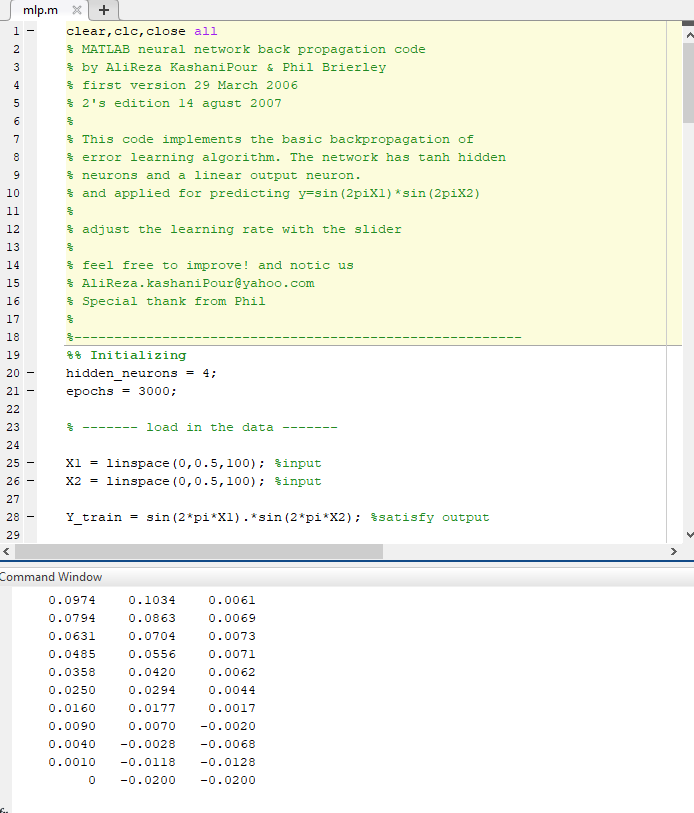
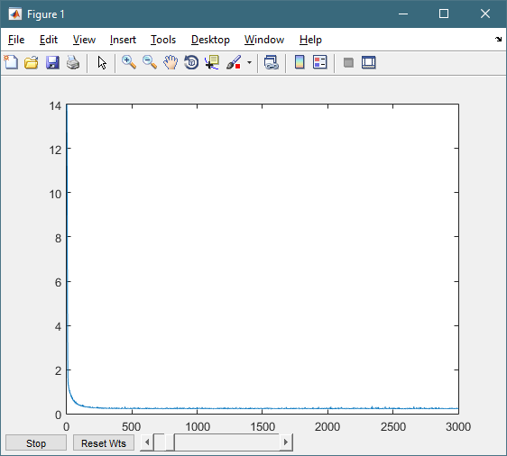
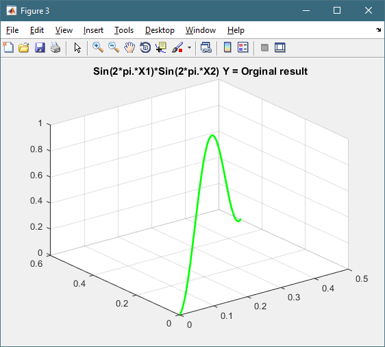
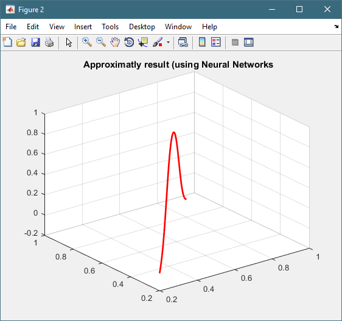

# IS-ND2

For this project I used a written program in Matlab that I found in https://www.mathworks.com/matlabcentral/fileexchange/17355-function-approximation-using-neural-network-without-using-toolbox

This project was quite self explanatory so I faced no difficulties with its use.

Snippet of program code:

Results of the aproximation:

